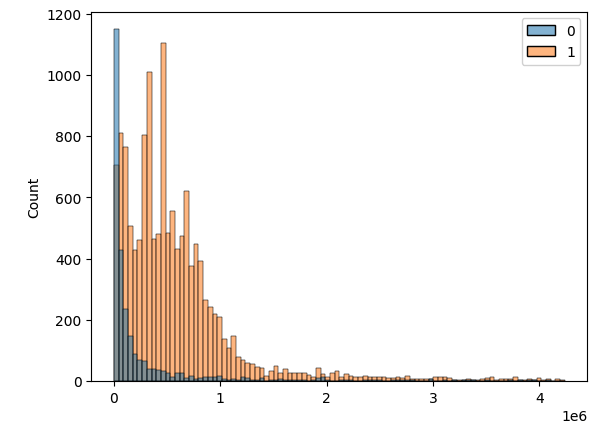
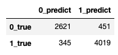
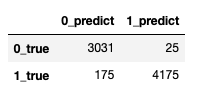

# References
- For feature extraction I used  `https://github.com/SuperCowPowers/data_hacking/blob/master/pefile_classification/pe_features.py`
- For modelling reference using tree models with Tensorflow I used `https://www.tensorflow.org/decision_forests/tutorials/beginner_colab`
- for additional files check re
    - `pefile_attributes.py`. Update it to work with python 3.10. 
    - images that are used in the notebook. 
    - `downloading_files.ipynb`. it download the files to the local machine. 
    - `sklearn_xgboost_model_for_exe_files.ipynb` Used this notebook to review features and try xgboost models.  
    
    
# Baseline Model performance

From Exploratory Data Analysis we observed that the malware files tends towards to exe files. 
- Clean files `{'dll': 7669, 'exe': 2800}`
- Infexted files `{'exe': 13889, 'dll': 654}`

Moreover we noticed that file size distribution is different for clean and infected files. 


For the baseline model we decided to use out of the box random forest model and the two features described above. 
`is_exe` and `file_size`.

Next we split the data into train test (0.7, 0.3) sets and train the model. 

For the model training we used accuracy metric. 

For the prediction cut off we used 0.5. 

#### The model metrics are: 
```
FPR = fp / (tn + fp) = 0.147
accuracy = 0.89
F1_score = 0.91
```

Confusion matrix 


From the confussion matrix we see that the model quite well predicts True positive - lower bottom corner.  On the other hand the model missclasifies the clean files. Our false positive rate is equal to `FPR = 0.147`. 

#### How to reduce FPR

First we must be avare that we are optimizing several metrics at once - accuracy and FPR. 
To reduce FPR we can try sevaral approaches. 

Fast fixes
1. choose more appropriate cut off point. For example 
    - `cut off point 0.7` returns `FPR = 0.118` with `accuracy = 0.9` and `F1_score = 0.89`.
    - `cut off point 0.95` returns `FPR = 0.053` with `accuracy = 0.81` and `F1_score = 0.81`.
    
2. Improve the model by: 
    1. tuning hyperparameters
    2. training model on another algorithms
    
Time consuming fixes

- Extracting more features. 
- Error analysis. Investigate what files  the model clasifies incorectly and check is it possible to improve the data. 


## GBoosting model performance using non-null features (the column must have at least 90% on non null values)

- `FPR = 0.008`
- `F1_score = 0.976`
- `accuracy = 0.972`
    
